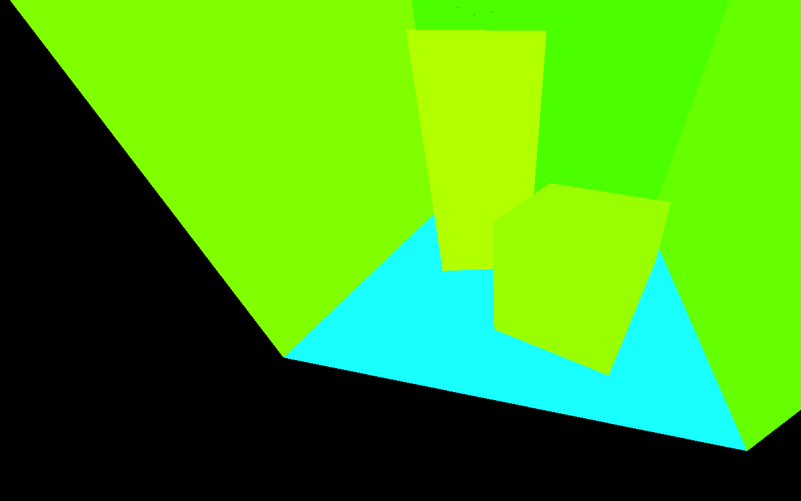
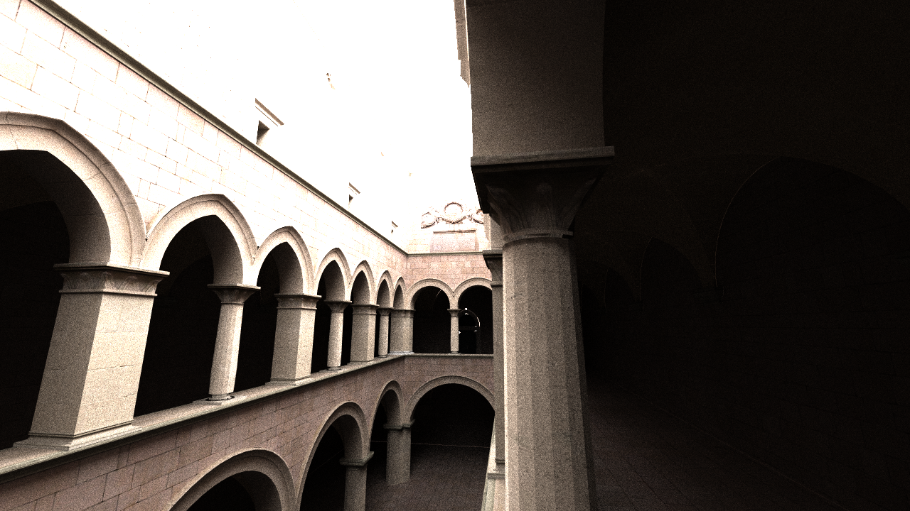
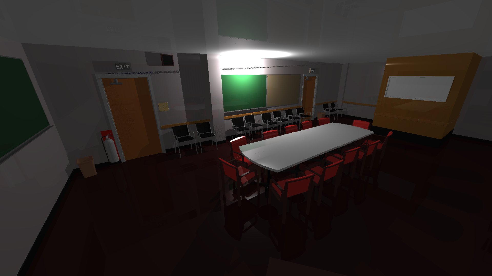
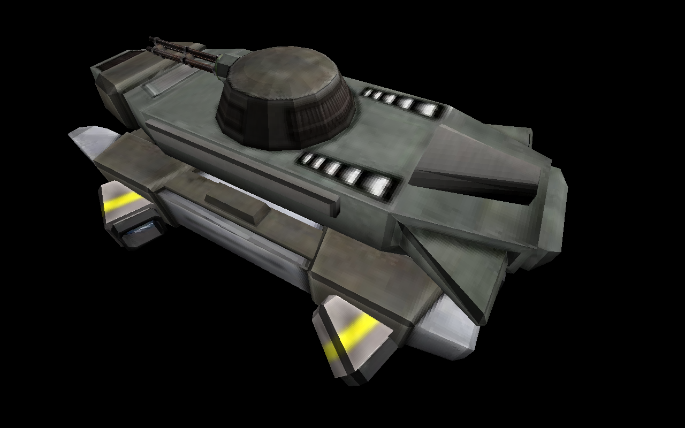

#  LightWelter; yet another raytracer

## Installation

### Dependencies
 - System packages (as named in Debian): libassimp-dev libglew-dev libsdl2-dev libsdl2-ttf-dev libsdl2-image-dev libboost-all-dev cmake
 - OpenGL ES 3.10 capable driver
 - C++14 capable compiler
 - internet connection (cmake will download some other dependencies)

### Installation
```bash
git clone https://github.com/acriaer/light-welter.git
cd light-welter
mkdir build
cd build
cmake -DCMAKE_BUILD_TYPE=Release ..
make -j4
cd ..
```

## Usage
```bash
./build/demo_app <rtc_file> [--<config_option_name>=<config_option_value>]*
```

You should see two windows: one for the opengl preview and one for the raytracer's output image. Press ENTER key to start raytracing. You can alse use some other keys:

 - X -- unlock free camera movement
 - WSADQE -- move the camera around
 - arrow keys -- change camera orientation
 - +/- -- increase/decrease the field of view
 - ESCAPE -- quit

For now please only use "standard" resolutions, i.e. 640x480 instead of 600x400.

### Important options

 - --interactive=0 ; disable gui
 - --iso=3000 ; change camera sensitivity
 - --threads=8 ; threadpool size

## Performance

Tested on Ubuntu 18.04 running on Intel i5-4670. Compilled with clang60.

Resolution 1280x720, one specular reflection + shadowrays.

| Scene      | No. of lights | Triangles | Time with SAH | Time without SAH |
| ---------- | ------------- | --------- | ------------- | ---------------- |
| Phoenix    | 1             | 2282      | 0m1.436s      | 0m2.123s         |
| Sponza     | 1             | 66450     | 0m20.736      | 0m18.723s        |
| Conference | 3             | 331179    | 0m47.176s     | 2m53.705s        |

## Examples

>./build/demo_app res/view_test/cornell.rtc --specular_reflection_factor=0.15



>./build/demo_app res/sponza/sponza.rtc --specular_reflection_factor=0.0



>./build/demo_app res/conference/conference.rtc --specular_reflection_factor=0.05



>./build/demo_app res/phoenix/phoenix.rtc --specular_reflection_factor=0.1



## Other software used
>http://ogldev.atspace.co.uk/index.html

>https://github.com/opengl-tutorials/ogl

>SDL2pp

>spdlog

>pugixml

>GLM

>CMakeRC